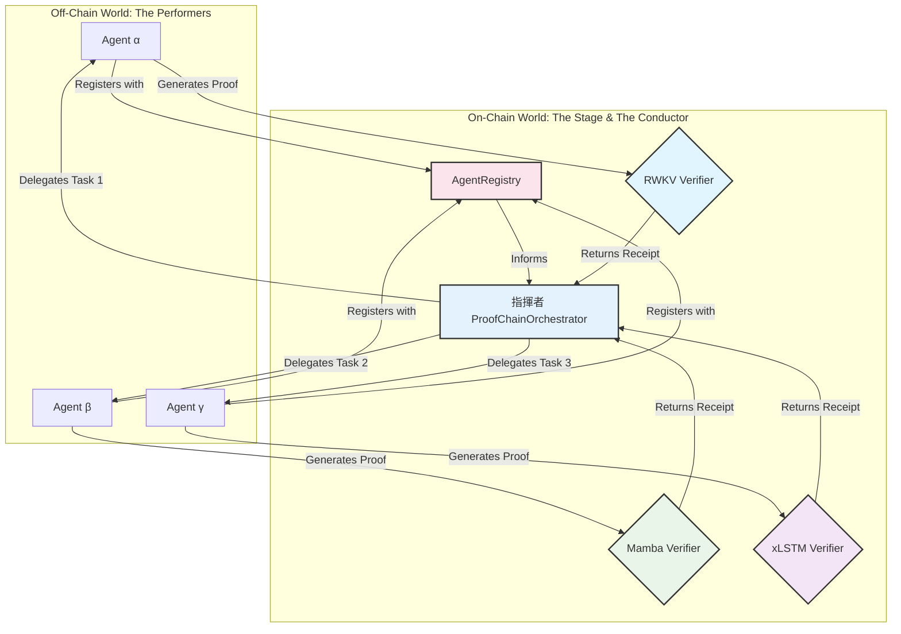

<p align="center">
  <pre>
    _   ____   ____   ____
   / \ |  _ \ / ___| / ___|
  / _ \| |_) | |    | |
 / ___ \  __/| |___ | |___
/_/   \_\_|   \____| \____|
  </pre>
</p>
<h1 align="center">The Agentic Proof-Chaining Framework</h1>
<p align="center">
  <strong>An On-Chain Orchestra for Verifiable AI Collaboration</strong>
</p>

---

## 🎼 Overture: The Vision

This project enables a **digital orchestra** where autonomous AI agents, each a master of its own "instrument" (a specific neural architecture), can collaborate to perform complex tasks. Their individual contributions are woven together into a single, verifiable "symphony" on the blockchain, all under the direction of a master **conductor**.

This repository contains the complete "Conductor's Score"—the smart contracts, agent source, and documentation for this framework.

---

## 📜 The Movements: Architecture

The framework is composed of distinct, yet harmonious, parts.

### **Movement I: The Performers (Off-Chain Agents)**
The off-chain agents are the individual musicians. They perform the heavy computational work of AI inference and generate the zero-knowledge proofs of their performance.

### **Movement II: The Stage (Verifier Contracts)**
The `contracts/verifiers` are the on-chain arbiters of truth. Each verifier is specialized to a specific AI architecture, ensuring that every note played by the performers is correct.

### **Movement III: The Conductor (Coordination Contracts)**
The `contracts/coordination` layer is the heart of the orchestra.
*   **`AgentRegistry.sol`**: The "musicians' guild," where agents register their capabilities.
*   **`ProofChainOrchestrator.sol`**: The **conductor**, who delegates tasks, verifies the cryptographic receipts from the verifiers, and ensures the entire composition is coherent.



---

## 🎻 The Performance: End-to-End Demo

To experience the symphony, simply conduct the performance. This script is the "Conductor's Baton," orchestrating the entire framework from proof generation to on-chain verification.

```bash
make conduct
```

The script will perform a silent, animated orchestration, culminating in a single, understated `✓`—the quiet confirmation that the entire composition is flawless.

---

##  coda: project structure

*   **`contracts/`**: The Solidity "sheet music."
*   **`scripts/`**: The deployment and interaction "arrangements."
*   **`src/`**: The Python source code for the "performers."
*   **`docs/`**: The detailed "program notes."
*   **`PHILOSOPHY.md`**: The "composer's manifesto."
*   **`ROADMAP.md`**: The schedule for "future seasons."
*   **`Dockerfile`**: A perfect replica of the "concert hall" for reproducible performances.
*   **`LICENSE`**: The terms of use for this composition.