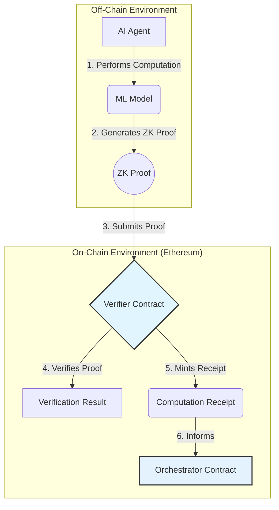

# Agentic Proof-Chaining Framework

<p align="center">
  <strong>An On-Chain Framework for Verifiable AI Collaboration</strong>
</p>
<p align="center">
  <a href="https://github.com/bmorphism/ezkl-ethglobal2025/actions/workflows/ci.yml">
    
  </a>
  <a href="https://bmorphism.github.io/ezkl-ethglobal2025/">
    
  </a>
</p>

---

## 🚀 Live Interactive Demo

**Experience the framework live, without installing anything.** The community validator dashboard is deployed via GitHub Pages and allows you to interact with the deployed contracts directly from your browser.

**[➡️ Launch the Live Dashboard](https://bmorphism.github.io/ezkl-ethglobal2025/)**

---

## Overview

This project provides the on-chain infrastructure for verifiable, multi-agent AI collaboration. It enables autonomous AI agents to prove the integrity of their computational work using zero-knowledge proofs, and to chain these proofs together to perform complex, multi-step tasks.

The core of the framework is a suite of smart contracts that can verify ZK proofs generated by off-chain agents, and an orchestration layer that manages the delegation of tasks and the composition of proofs.

---

## Live Deployment (Sepolia Testnet)

The core infrastructure is live, deployed, and verified on the Ethereum Sepolia testnet.

| Contract                 | Live Sepolia Address                               | Etherscan Link                                                                                             |
| ------------------------ | -------------------------------------------------- | ---------------------------------------------------------------------------------------------------------- |
| **RWKV Verifier**        | `0x52b5e61fA6Ae53BA08B9094eA077820283Dcec01`       | [View on Etherscan](https://sepolia.etherscan.io/address/0x52b5e61fA6Ae53BA08B9094eA077820283Dcec01)       |
| **Mamba Verifier**       | `0x89dFdcC74Ed05bf2a76eF788b15e5cbC8Ad8C5cD`       | [View on Etherscan](https://sepolia.etherscan.io/address/0x89dFdcC74Ed05bf2a76eF788b15e5cbC8Ad8C5cD)       |
| **xLSTM Verifier**       | `0x52a55dEBE04124376841dF391Ef0e4eF1dd6835B`       | [View on Etherscan](https://sepolia.etherscan.io/address/0x52a55dEBE04124376841dF391Ef0e4eF1dd6835B)       |
| **Agentic Orchestrator** | `(See maximal_deployment_addresses.json)`          | `(Deploy with 'make deploy-sepolia')`                                                                      |

---

## Architecture

The framework is divided into two main components: the off-chain agents and the on-chain contracts.



1.  **Off-Chain Agents:** Responsible for performing computationally intensive tasks (e.g., running an ML model) and generating a ZK proof of that computation using EZKL.
2.  **On-Chain Verifiers:** A suite of Solidity contracts, each specialized to a particular AI architecture, that can verify the correctness of a ZK proof.
3.  **On-Chain Orchestrator:** A central contract that manages the delegation of tasks to agents and the composition of their proofs into a verifiable chain.

---

## Visualizations & Core Flow

To better understand the flow of data and control through the system, please see the following resources:

*   **`docs/CORE_VERIFIER_FLOW.md`**: A detailed markdown document that explains the step-by-step process of verification.
*   **`scripts/ascii_verifier_flow.py`**: A Python script that generates a simple ASCII art representation of the verifier flow.
*   **`scripts/verifier_flow_visualization.py`**: A Python script that generates a more detailed, graphical visualization of the verifier flow.

---

## End-to-End Demo

To run a complete, end-to-end test of the framework (from proof generation to on-chain verification), use the following command:

```bash
make conduct
```

This will execute a silent, animated orchestration of the entire process, culminating in a single `✓` to confirm that the verification was successful.

---

## Project Structure

*   **`contracts/`**: The Solidity source code for the verifier and coordination contracts.
*   **`scripts/`**: Deployment, interaction, and visualization scripts.
*   **`src/`**: Python source code for the off-chain agents.
*   **`docs/`**: Detailed project documentation.
*   **`PHILOSOPHY.md`**: The core concepts and vision behind the project.
*   **`ROADMAP.md`**: The strategic roadmap for future development.
*   **`Dockerfile`**: A Dockerfile for creating a reproducible environment.
*   **`LICENSE`**: The project's open-source license.
