# 🎵 Agentic Proof-Chaining Framework - Maximal Edition 🎵

This repository contains the smart contracts, agent code, and documentation for a comprehensive, multi-agent proof-chaining framework using EZKL. It provides the on-chain infrastructure for a new kind of verifiable, multi-agent AI collaboration.

## The Vision: An AI Orchestra

This project enables a "digital orchestra" where autonomous AI agents, each a master of its own "instrument" (a specific neural architecture), can collaborate to perform complex tasks. Their individual contributions are woven together into a single, verifiable "symphony" on the blockchain, all under the direction of a master "conductor."

---

## 🎼 The Architectural Overture

This diagram provides a high-level overview of the entire system, now including the coordination layer.

```mermaid
graph TD
    subgraph "Off-Chain World: The Performers"
        A[Agent α]
        B[Agent β]
        C[Agent γ]
    end

    subgraph "On-Chain World: The Stage & The Conductor"
        A -- Registers with --> R[AgentRegistry]
        B -- Registers with --> R
        C -- Registers with --> R

        R -- Informs --> O[ProofChainOrchestrator]

        A -- Generates Proof --> V1{RWKV Verifier}
        O -- Delegates Task 1 --> A
        V1 -- Returns Receipt --> O

        B -- Generates Proof --> V2{Mamba Verifier}
        O -- Delegates Task 2 --> B
        V2 -- Returns Receipt --> O

        C -- Generates Proof --> V3{xLSTM Verifier}
        O -- Delegates Task 3 --> C
        V3 -- Returns Receipt --> O
    end
    
    style R fill:#fce4ec,stroke:#333,stroke-width:2px
    style O fill:#e3f2fd,stroke:#333,stroke-width:2px
    style V1 fill:#e1f5fe,stroke:#333,stroke-width:2px
    style V2 fill:#e8f5e8,stroke:#333,stroke-width:2px
    style V3 fill:#f3e5f5,stroke:#333,stroke-width:2px
```



---

## 🎶 The Proof-Chaining Symphony

This sequence diagram illustrates the full, orchestrated workflow, from agent registration to the completion of a multi-step task.


---

## 🎻 Meet the Orchestra

Each component in this framework plays a specific role in the overall composition.

*   **The Composers (Python Agents):**
    *   `src/`: The off-chain agents that perform the computations and generate the ZK proofs.

*   **The Concert Hall (Solidity Contracts):**
    *   `contracts/verifiers/`: The individual "instrument sections," each responsible for verifying proofs from a specific AI architecture.
    *   `contracts/coordination/AgentRegistry.sol`: The "musicians' guild," where agents register their capabilities and stake their reputation.
    *   `contracts/coordination/ProofChainOrchestrator.sol`: The "conductor," who directs the entire performance, delegating tasks and ensuring the final composition is coherent.

*   **The Program Notes (Documentation):**
    *   `docs/`: Contains the detailed specifications and guides that explain the theory and structure behind the music.

---

## Getting Started

1.  **Install Dependencies:**
    ```bash
    npm install
    pip install -r requirements.txt
    ```

2.  **Configure Environment:**
    *   Create a `.env` file and populate it with your Sepolia RPC URL and private key.

3.  **Deploy the Maximal Framework:**
    ```bash
    npx hardhat run scripts/deploy_maximal_framework.js --network sepolia
    ```

## Directory Structure

*   `contracts/`:
    *   `verifiers/`: The ZK verifier contracts.
    *   `coordination/`: The agent coordination contracts.
*   `scripts/`: Deployment and testing scripts.
*   `src/`: Python source code for agents.
*   `ezkl_workspace/`: EZKL models and inputs.
*   `config/`: Deployment addresses and configuration.
*   `docs/`: Project documentation.
