# 🎵 Agentic Proof-Chaining Framework 🎵

This repository contains the smart contracts, agent code, and documentation for a comprehensive, multi-agent proof-chaining framework using EZKL. It provides the on-chain infrastructure for a new kind of verifiable, multi-agent AI collaboration.

## The Vision: An AI Orchestra

This project enables a "digital orchestra" where autonomous AI agents, each a master of its own "instrument" (a specific neural architecture), can collaborate to perform complex tasks. Their individual contributions are woven together into a single, verifiable "symphony" on the blockchain.

---

## 🎼 The Architectural Overture

This diagram provides a high-level overview of the entire system, from the off-chain agents to the on-chain verifiers.


---

## 🎶 The Proof-Chaining Symphony

This sequence diagram illustrates how the "music" is created—how receipts are passed from one agent to the next to form a verifiable chain of computation.

```mermaid
sequenceDiagram
    participant Agent_Alpha as Agent α (RWKV)
    participant RWKV_Verifier
    participant Agent_Beta as Agent β (Mamba)
    participant Mamba_Verifier
    participant Agent_Gamma as Agent γ (xLSTM)
    participant xLSTM_Verifier

    Agent_Alpha->>+RWKV_Verifier: generateReceipt(proof, 0x0)
    RWKV_Verifier-->>-Agent_Alpha: receipt_A

    Agent_Beta->>+Mamba_Verifier: verifyChainedComputation(proof, receipt_A)
    Mamba_Verifier-->>-Agent_Beta: receipt_B

    Agent_Gamma->>+xLSTM_Verifier: verifyOperadCompletion(proof, [receipt_A, receipt_B])
    xLSTM_Verifier-->>-Agent_Gamma: final_operad_receipt
```



---

## 🎻 Meet the Orchestra

Each component in this framework plays a specific role in the overall composition.

*   **The Composers (Python Agents):**
    *   `src/simple_ezkl_models.py`: Defines the simple "melodies" (AI models) that our agents will perform.
    *   `src/real_model_inference.py`: The "virtuoso" agent that performs the complex computation and generates the ZK proof.

*   **The Sheet Music (EZKL Workspace):**
    *   `ezkl_workspace/`: Contains the core "musical scores" (ONNX models and input data) that define the computational tasks.

*   **The Concert Hall (Solidity Contracts):**
    *   `contracts/ProductionRWKVVerifier.sol`: The "first chair" verifier, responsible for validating the opening movements of the symphony.
    *   `contracts/ProductionMambaVerifier.sol`: The "second chair," verifying the intermediate, more complex parts of the composition.
    *   `contracts/ProductionxLSTMVerifier.sol`: The "conductor," responsible for verifying the grand finale and ensuring the entire operad is coherent.

*   **The Program Notes (Documentation):**
    *   `docs/`: Contains the detailed specifications and guides that explain the theory and structure behind the music.

---

## Getting Started

1.  **Install Dependencies:**
    ```bash
    npm install
    pip install -r requirements.txt
    ```

2.  **Configure Environment:**
    *   Create a `.env` file and populate it with your Sepolia RPC URL and private key.

3.  **Deploy Contracts:**
    ```bash
    npx hardhat run scripts/deploy_sepolia.js --network sepolia
    ```

## Directory Structure

*   `contracts/`: Solidity source code.
*   `scripts/`: Deployment and testing scripts.
*   `src/`: Python source code for agents.
*   `ezkl_workspace/`: EZKL models and inputs.
*   `config/`: Deployment addresses and configuration.
*   `docs/`: Project documentation.
